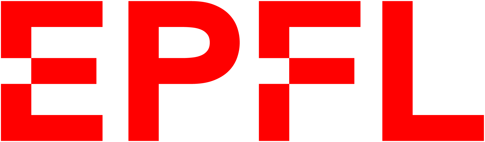
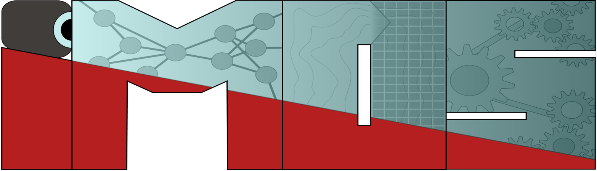
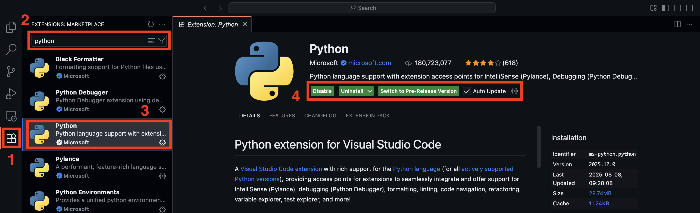
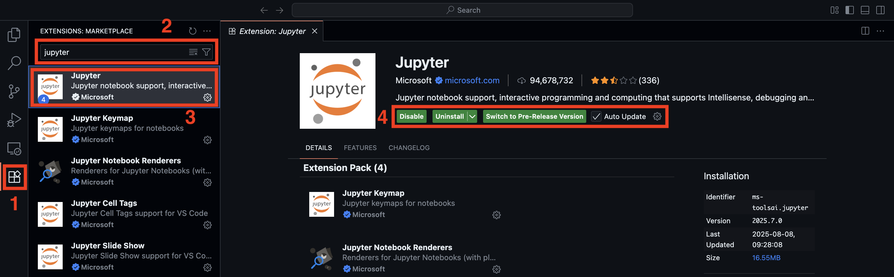
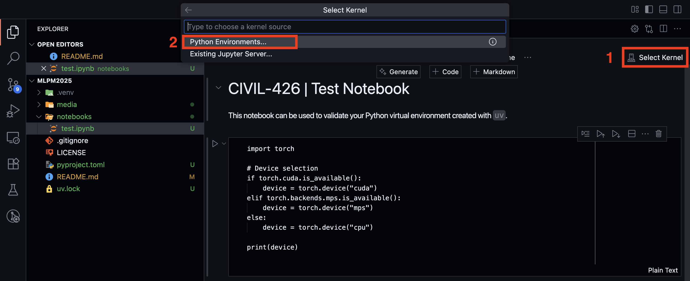
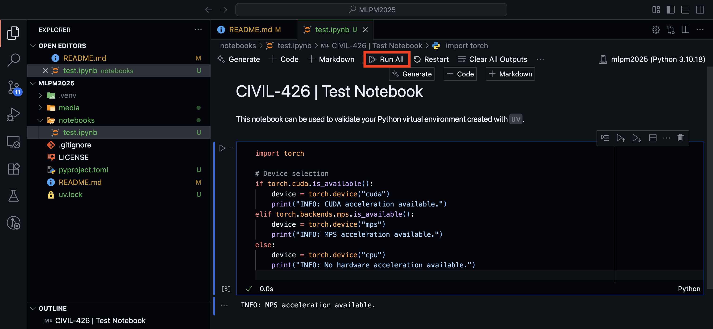

# CIVIL-426 | Machine Learning for Predictive Maintenance - 2025

<p align="center">
    
    &nbsp;&nbsp;&nbsp;&nbsp;&nbsp;&nbsp;&nbsp;&nbsp;&nbsp;&nbsp;
    
</p>

This repository provides the setup materials for the course Machine Learning for 
Predictive Maintenance. Its main purpose is to help students configure a standardized 
programming environment on their personal machines. By following the instructions here,
all students will work with the same package versions, dependencies, and tools, ensuring
that assignments and projects run smoothly and reproducibly across different systems.

> ⚠️ **NOTE**️: Students are strongly encouraged to use the proposed environment. If you 
> decide not to, you are fully responsible for ensuring the reproducibility of your code. 
> No support will be provided during class for debugging dependency issues or Python 
> installation problems outside of the standardized setup.


## Table of Contents

- [CIVIL-426 | Machine Learning for Predictive Maintenance - 2025](#civil-426--machine-learning-for-predictive-maintenance---2025)
  - [Table of Contents](#table-of-contents)
  - [Overview](#overview)
  - [Requirements](#requirements)
  - [Creating the Python Virtual Environment](#creating-the-python-virtual-environment)
    - [macOS Procedure](#macos-procedure)
    - [Windows Procedure](#windows-procedure)
    - [Linux Procedure](#linux-procedure)
  - [Visual Studio Code Configuration](#visual-studio-code-configuration)
  - [Q\&A](#qa)
  - [References](#references)

## Overview

For this course, we use [**uv**](https://docs.astral.sh/uv/) as the Python dependency 
manager. `uv` is a fast, cross-platform tool that ensures consistent development 
environments across Windows, macOS, and Linux. By relying on it, we avoid version 
conflicts and guarantee that assignments and projects behave the same way on all systems.

All Python packages required for the course are specified in this repository, and `uv` 
will automatically install them in a clean, isolated virtual environment.

For development, we will use [**Visual Studio Code**](https://code.visualstudio.com/) as
the recommended editor. It integrates smoothly with Python environments created by `uv`
and provides useful features such as linting, debugging, and notebook support.

In summary, the installation process consists of:
1. Installing `uv` on your system
2. Creating the course Python environment using the provided configuration
3. Opening the project in Visual Studio Code and linking it to the environment

## Requirements

Prior to starting the installation process, we recommend that you have the following:

- **Git (strongly recommended):**
  We strongly encourage students to use [Git](https://git-scm.com/) for version control
  of their code and project files. Version control will help you track changes and 
  recover previous versions of your work if needed. To commit Jupyter notebooks, we 
  recommend committing them with all output cells cleared. This makes it easier to 
  compare different versions of the notebooks and avoids unnecessary clutter in your 
  Git history.

## Creating the Python Virtual Environment

### macOS Procedure

> ✅️ **NOTE**️: The following installation procedure supports hardware acceleration on
> macOS with Apple Silicon chips using the 
> [MPS device](https://docs.pytorch.org/docs/stable/notes/mps.html). No special steps
> are required.

0. Open a terminal.

1. Install [uv](https://github.com/astral-sh/uv) using the [official instructions](https://github.com/astral-sh/uv?tab=readme-ov-file#installation):

```zsh
curl -LsSf https://astral.sh/uv/install.sh | sh
```

2. Restart your terminal (as requested at the end of the installation process).

3. Install Python 3.10 with `uv`:

```zsh
uv python install 3.10
```

4. Clone this GitHub repository (somewhere on your machine):

```zsh
git clone https://github.com/EPFL-IMOS/MLPM2025
```

5. Navigate inside the cloned repository:

```zsh
cd MLPM2025
```

6. Create the Python virtual environment using `uv`:

```zsh
uv sync
```

7. Activate the `python` virtual environment we just created. ⚠️ **NOTE**: this must be ran
everytime you open a new terminal and want to use the `MLPM2025` Python environment.
```zsh
source .venv/bin/activate
```

### Windows Procedure

> ✅️ **NOTE**️: The following installation procedure supports hardware acceleration on
> Windows if you have an NVIDIA GPU. Use the `--extra=gpu` flag with `uv sync`.

0. Open a **Powershell** terminal. ⚠️ **NOTE**: We will always assume that your terminal
is a Powershell instance, not a Command Prompt.

2. Install [uv](https://github.com/astral-sh/uv) using the [official instructions](https://github.com/astral-sh/uv?tab=readme-ov-file#installation):

```powershell
powershell -ExecutionPolicy ByPass -c "irm https://astral.sh/uv/install.ps1 | iex"
```

2. Restart your terminal (as requested at the end of the installation process).

3. Install Python 3.10 with `uv`:

```powershell
uv python install 3.10
```

4. Clone this GitHub repository (somewhere on your machine):

```powershell
git clone https://github.com/EPFL-IMOS/MLPM2025
```

5. Navigate inside the cloned repository:

```powershell
cd MLPM2025
```

6. Create the Python virtual environment using `uv`:

```powershell
uv sync
```

7. Activate the `python` virtual environment we just created. ⚠️ **NOTE**️: this must
be ran everytime you open a new terminal and want to use the `MLPM2025` Python environment.
```powershell
.venv\Scripts\activate.ps1
```

### Linux Procedure

> ✅️ **NOTE**️: The following installation procedure supports hardware acceleration on
> Linux if you have an NVIDIA GPU. Use the `--extra=gpu` flag with `uv sync`.

0. Open a terminal.

1. Install [uv](https://github.com/astral-sh/uv) using the [official instructions](https://github.com/astral-sh/uv?tab=readme-ov-file#installation). If you face an error saying 
that `curl` is missing, you can install it with `sudo apt install curl`, or use `wget` 
instead.

```bash
curl -LsSf https://astral.sh/uv/install.sh | sh
```

1. Restart your terminal (as requested at the end of the installation process).

2. Install Python 3.10 with `uv`:

```bash
uv python install 3.10
```

4. Clone this GitHub repository (somewhere on your machine):

```bash
git clone https://github.com/EPFL-IMOS/MLPM2025
```

5. Navigate inside the cloned repository:

```bash
cd MLPM2025
```

6. Create the Python virtual environment using `uv`:

```bash
uv sync
```

7. Activate the `python` virtual environment we just created. ⚠️ **NOTE**: this must be ran
everytime you open a new terminal and want to use the `MLPM2025` Python environment.
```bash
source .venv/bin/activate
```

## Visual Studio Code Configuration

0. Install [Visual Studio Code](https://code.visualstudio.com/) on your machine.

1. Open VS Code and install the official 
[Python extension](https://marketplace.visualstudio.com/items?itemName=ms-python.python)
inside VS Code as follows:

<p align="center">
    
</p>

2. Install the official 
[Jupyter extension](https://marketplace.visualstudio.com/items?itemName=ms-toolsai.jupyter) 
inside VS Code as follows:

<p align="center">
    
</p>

3. Open the `MLPM2025` directory inside VS Code using "File" >> "Open Folder".

4. Open the `notebooks/test.ipynb` Jupyter Notebook inside VS Code. Select the newly
created virtual environment as kernel:

<p align="center">
    
    
</p>

5. Run the entire Jupyter notebook by clicking on "Run All" at the top of the notebook.
The notebook should run without any issues, and should determine if your installation 
supports hardware acceleration or not.

<p align="center">
    
</p>

## Q&A

1. **Can I delete the `MLPM2025` repository after installation?**

No you cannot, because your Python virtual environment is stored entirely inside the
`.venv` folder in the repository.

2. **I want to delete the `MLPM2025` virtual environment. How can I do it?**

Navigate to the `MLPM2025` repository on your machine, and delete the `.venv` 
directory.

3. **I messed up the `MLPM2025` virtual environment. How can I recover?**

Navigate to the root of the `MLPM2025` repository on your machine, and delete the `.venv` 
directory. Then, run `uv sync` from a terminal at the root of the `MLPM2025` repository.

4. **The TAs told me to update my virtual environment. How can I do it?**

Navigate to the root of the `MLPM2025` repository on your machine, and run `uv sync` 
from a terminal.

5. **I want to install a new package/dependency. How can I do it?**

First, make sure you really need that additional dependency. Then, if you absolutely
need to install it, use `uv add` to add a new package to the virtual environment. For
example, `uv add torchinfo` to add the `torchinfo` package.

## References

- [CIVIL-426 Course Book](https://edu.epfl.ch/coursebook/en/machine-learning-for-predictive-maintenance-applications-CIVIL-426)
- [CIVIL-426 Moodle Page](https://moodle.epfl.ch/course/view.php?id=17052)
- [uv Python Package Manager](https://docs.astral.sh/uv/)
